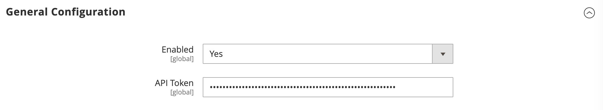
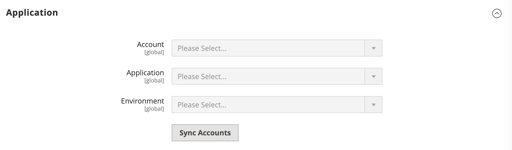
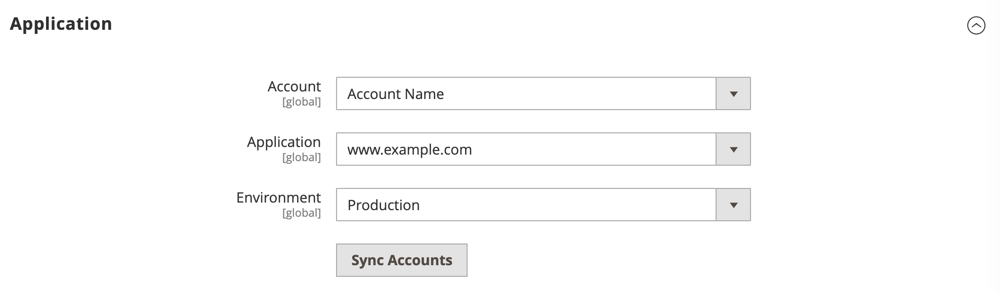
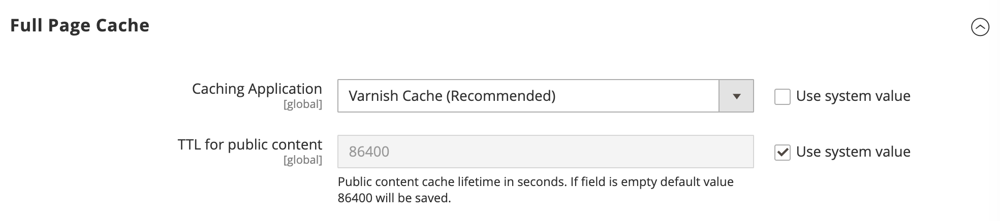
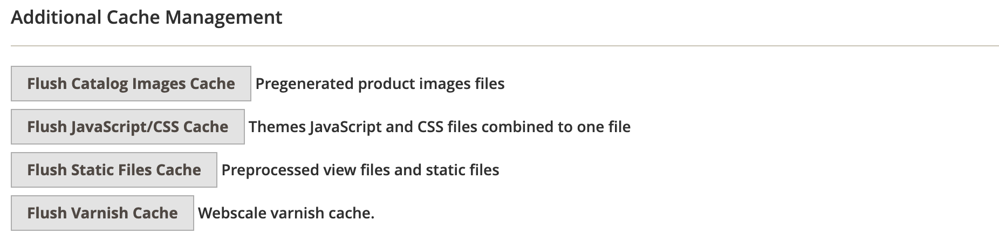

# Webscale_Varnish module
Allows to setup and configure Webscale varnish cache implementation.

## Installation
To install extension run the following in magento root directory:

```console
composer config repositories.webscale-networks vcs https://github.com/webscale-networks/magento-varnish.git
composer require webscale-networks/magento-varnish
```

After composer installs the package run next Magento commands:

```console
php bin/magento module:enable Webscale_Varnish
php bin/magento setup:upgrade
bin/magento cache:clean
```

Once completed log in to the Magento admin panel and proceed to configuring the extension.

## Configuration

To enter the credentials open a browser and log in to the Magento admin. Next, navigate to:
```
Stores > Configuration > Webscale > Varnish
```

Enable the module by switching `Enabled` to `Yes` under `General Configuration` section and enter API token:



Save the configuration. Next, click on `Sync Accounts` button under `Application` section:



Once accounts synced select `Account`, `Application` and `Environment` in the corresponding fields and save configuration.



After setting up Account and Application navigate to `Stores > Configuration > Advanced > System`, open `Full Page Cache` section and select `Varnish Cache` in `Caching Application` field:



### Optional

You can also select `Enable Debug` under `Developer` section - this option will enable more detailed server logs:


Log file can be found at `MAGENTO_ROOT/var/log/webscale.log`.

## Managing Varnish Cache

Webscale varnish cache will be flushed by default with all Magento native cache events, partial by tags or full cache flush.
To flush specifically Webscale varnish cache navigate to `System > Tools > Cache Management` and click `Flush Varnish Cache` button under `Additional Cache Management` section:


